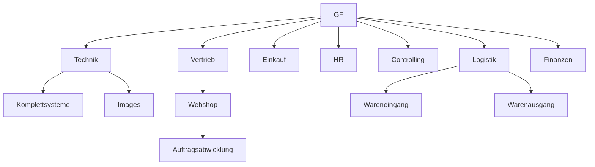

# Initialisierung:
___
### TODO

-  Anwenden der 5 Phasen  nach Burkhardt (grob)
-  [x] Initialisierung
-  [ ] Definition
-  [ ] Planung
-  [ ] Steuerung
-  [ ] Abschluss

Flurgespräch / Initierung / Vorstellung Projekt
___
Gaming Branche
Kunden PCs

Anforderungen:
	- Computer müssen installiert werden mit eigenem modifizierten Betriebsystem.
	- Im Betriebssytem sollen 3 Firmen eigene Produkte vorinstalliert sein.
	- PC Hardware wird nach online Bestellung abgearbeitet.
	- Ein Webshop existiert bereits.
	- Das Projekt soll innerhalb von 2 Jahren umgesetzt werden.

Als Projektleiter befinden Sie sich in einer starken Matrix Organisation.

Related:
Prince2 -> Was wie warum

### Unternehmensstruktur
___

### Projektphasen
---

**Was**
Eine neue Fertigungsstrasse soll erstellt werden in dieser werden Computer installiert und zum Versand fertig gemacht. Ein Betriebsystem soll automatisiert mit Software installiert werden. Auslieferung soll von Personal für die Logistik vorbereitet werden.

Wie
Neues Personal, Locations müssen gemietet / gekauft werden. Logistik muss gemanaged werden.

***Warum***
Der Umsatz soll gesteigert werden um neue Branchen zu erschließen.

### [[SMART]] - Bewertung des Projektes nach SMART
___

**S**pezifisch
- Einführung einer neuen Fertigungstraße für vorinstallierte Computer und Eröffnung eines neuen Unternehmenszweiges.

**M**essbar
- Der Umsatz soll zu 20% gesteigert werden um neue Branchen zu erschließen.

**A**ttraktiv
- Der Bedarf des Marktes soll gedeckt werden.

**R**ealistisch
- Durch den vorhanden Webshop und zugesagten Finanzierungen kann eine Umsetzung statt finden.
	
**T**erminiert
- Das Ziel soll innerhalb von 2 Jahren in den normal Betrieb übergehen.

>Durch die Einführung einer neuen Fertigungstraße für vorinstallierte Computer innerhalb von 2 Jahren, soll der Umsatz um min 20% gesteigert werden

### Ziele skizzieren
___

###### Einmaligkeit
- Ein ähnliches Projekt existiert nicht im Unternehmen und die Einmaligkeit ist somit gegeben. 

###### Komplexität
- Die Interdisziplinarität ist durch Bereichsübergreifende

###### Risiken
- Konkurrenz Produkte?

###### Innovation
- Wir die Innovation im eigenen unternehmen betrachtet oder im vergleich zur Konkurrenz.
Kunden können ihre Gaming PCs  ohne Vertrieb konfigurieren (24/7)

Begrenzte Ressourcen

Personal, Räumlichkeiten, Zeit

## Zuständigkeiten
___
### Projektbeteiligte
- Rechnungswesen / Finance department
- Controlling
- HR
- Logistik
- Webshop
- Einkauf

- Stakeholder Analyse
	- Wer hat interesse
	- Was ist Ziel für dieses Projekt,
	- Welches Ziel verfolgen die Stakeholder.
	- Wer investiert wieviel (Zeit,Kosten,Ressourcen) / [[Definition des Magischen Dreiecks im Projektmanagement|Magisches Dreieck]]

HR
- Zuständig um die spätere Abteilung aus dem Projekt entstehende Abteilung mit Personal zu besetzen.

Gibt es externe Sponsoren?
Gibt es ein Steeringboard.

___

### Projektmanagment  Prozesse

### FRAGEN
___
Wieviel Kapital steht zur Verfügung.

Wie hoch ist unser Budget.

Wie viele Mitarbeiter aus jeder gelisteten [[Outline#Projektbeteiligte|Abteilung]]  brauchen wir.

### References

Projektablaufplan -> Projektanbahnung.pdf S.56 