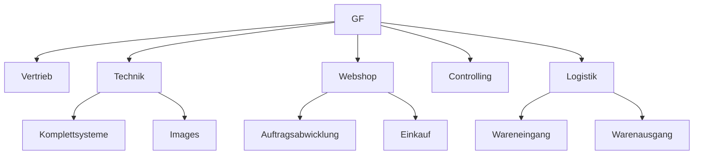

# Outline Lerngruppe (60 min)

### 10-15 min
___
- Fragen zur Lerneinheiten - Projektmanagement

- Vorstellung Projekt

Gaming Branche
Kunden PCs

Anforderungen:
	- Computer müssen installiert werden mit eigenem modifizierten Betriebsystem.
	- Im Betriebssytem sollen 3 Firmen eigene Produkte vorinstalliert sein.
	- PC Hardware wird nach online Bestellung abgearbeitet.
	- Ein Webshop existiert bereits.
	- Das Projekt soll innerhalb von 2 Jahren umgesetzt werden.

Als Projektleiter befinden sich in einer starken Matrix Organisation.

Related:
Prince2 -> Was wie warum
___

### TODO
-  Anwenden der 5 Phasen  nach Burkhardt (grob)
-  [x] Initialisierung
-  [ ] Definition
-  [ ] Planung
-  [ ] Steuerung
-  [ ] Abschluss
	
-  [ ]   Zusammenfassung schreiben für unser Smart Ziel
### Projektphasen
---

# Initialisierung:
___

### Was
Eine neue Fertigungsstrasse soll erstellt werden in dieser werden Computer installiert und zum Versand fertig gemacht. Ein Betriebsystem soll automatisiert mit Software installiert werden. Auslieferung soll von Personal für die Logistik vorbereitet werden.

### Wie
Neues Personal, Locations müssen gemietet / gekauft werden. Logistik muss gemanaged werden.

### Warum
Der Umsatz soll gesteigert werden um neue Branchen zu erschließen.

### [[SMART]]
Bewertung des Projektes nach SMART
___

Spezifisch
- Einführung einer neuen Produktlinie und Eröffnung eines neuen Unternehmenszweiges.

Messbar
- Der Umsatz soll zu 20% gesteigert werden um neue Branchen zu erschließen.

Attraktiv
- Der Bedarf des Marktes soll gedeckt werden.

Realistisch
- Durch den vorhanden Webshop und zugesagten Finanzierungen kann eine Umsetzung statt finden.
	
Terminiert
- Das Ziel soll innerhalb von 2 Jahren in den normal Betrieb übergehen.

Definition nach DIN69901

### Ziele skizzieren
Einmaligkeit
Ein ähnliches Projekt existiert nicht im Unternehmen und die Einmaligkeit ist somit gegeben. 

Komplexität
Die Interdisziplinarität ist durch Bereichsübergreifende

Risiken
- Konkurrenz Produkte?

Innovation
? Wir die Innovation im eigenen unternehmen betrachtet oder im vergleich zur Konkurrenz.
Kunden können ihre Gaming PCs  ohne Vertrieb konfigurieren (24/7)

Begrenzte Ressourcen

Personal, Räumlichkeiten, Zeit

### Zuständigkeiten
- Stakeholder Analyse
	- Wer hat interesse
	- Was ist Ziel für dieses Projekt,
	- Welches Ziel verfolgen die Stakeholder.
	- Wer investiert wieviel (Zeit,Kosten,Ressourcen) / [[Definition des Magischen Dreiecks im Projektmanagement|Magisches Dreieck]]

### Projektbeteiligte
- Rechnungswesen / Finance department
- Controlling
- 

Gibt es externe Sponsoren?
Gibt es ein Steeringboard.

Wieviel Kapital steht zur Verfügung.

### Projektmanagment Prozesse

### Organigram

